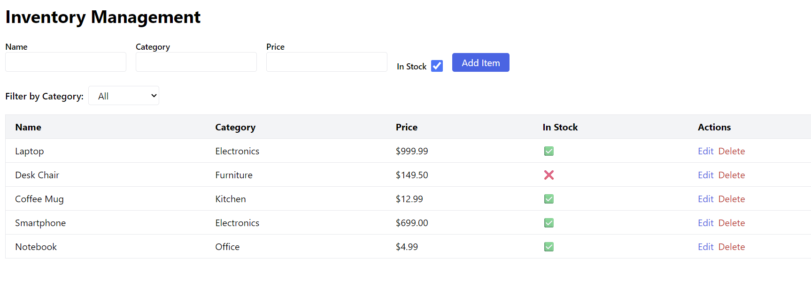
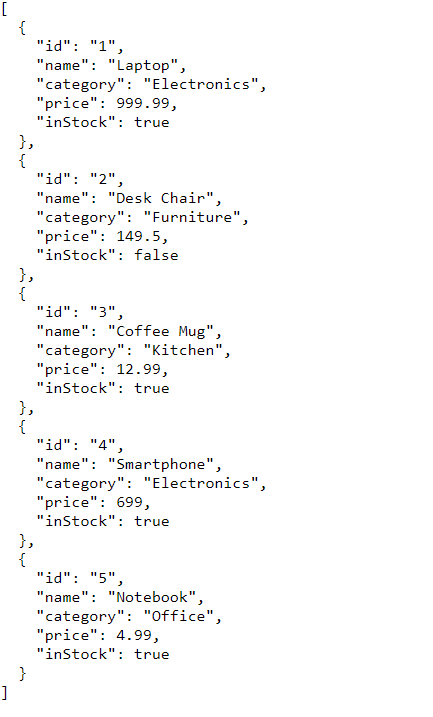

# Full‑Stack Demo: React + Express + Playwright

A polished demo project showcasing a modern full‑stack application with:

- **Frontend**: React 18, TypeScript, Vite, Tailwind CSS
- **Backend**: Express, TypeScript, REST API with in‑memory data
- **Testing**: End‑to‑end UI tests and API tests with Playwright
- **CI**: GitHub Actions workflow that runs tests on every push

---

## Getting Started

### Prerequisites

- Node.js (v18 or later)
- npm

### Installation & Running

```bash
# Clone and install everything
git clone https://github.com/yourusername/my-demo-app.git
cd my-demo-app
npm install
cd backend && npm install
cd ../frontend && npm install
cd ..
# Run both frontend and backend concurrently
npm run dev

# Running Tests
Run the frontend/backend as above and open a new cmd to run the tests.
Restart the backend for each test run as the data will be reset (otherwise the tests will fail)

# install playwright
npx playwright install 

# All tests (UI + API)
npm test

# With headed browser
npm run test:headed

# View the HTML report
npx playwright test --reporter=html

# Build for production
npm run build

# Project Structure
.
├── backend/          # Express API (TypeScript)
├── frontend/         # React app (TypeScript + Vite)
├── tests/            # Playwright tests (UI + API)
├── .github/          # GitHub Actions CI
├── package.json      # Root scripts
└── README.md


# Features

- **Inventory Management**: View, add, edit, delete items
- **Category Filter**: Dropdown to filter items by category
- **Responsive Table**: Clean, sortable presentation
- **REST API**: Full CRUD operations
- **Playwright Tests**:
  - **UI**: interaction with the table, filter, add/delete
  - **API**: validate endpoints with real requests

# Technologies

| Area                  | Tools                                                       |
| --------------------- | ----------------------------------------------------------- |
| **Frontend**          | React, TypeScript, Vite, Tailwind CSS, Axios                |
| **Backend**           | Express, TypeScript, CORS, dotenv                           |
| **Testing**           | Playwright (UI + API)                                       |
| **CI**                | GitHub Actions                                              |
| **Dev Experience**    | Concurrently running frontend/backend, hot reload           |

# Demo

## Demo


*Frontend UI*


*Backend API response*

# License

MIT
